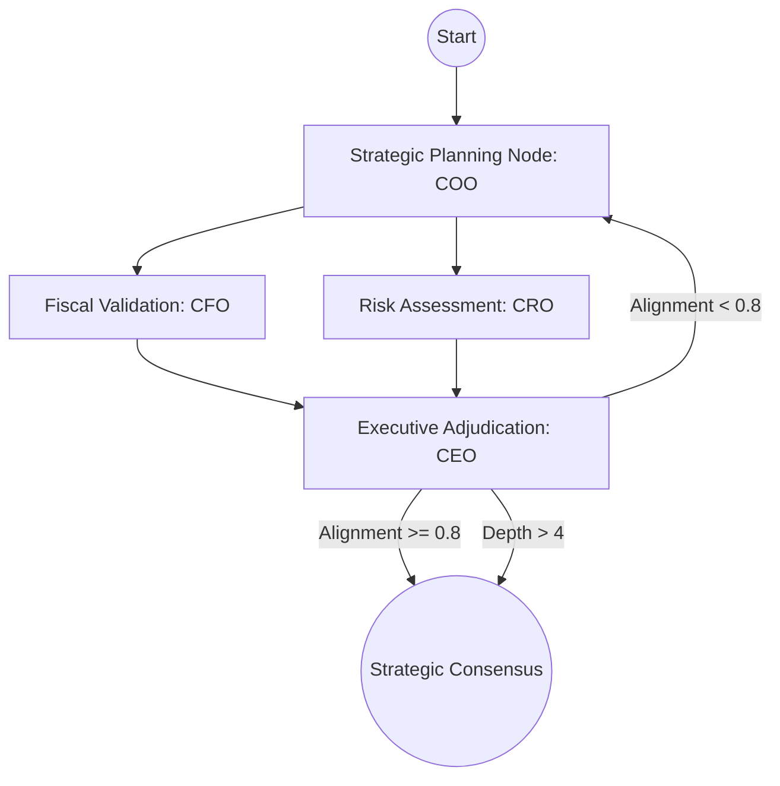

# Synthetic Enterprise Decision-Support (SEDS) Framework

[](https://www.python.org/downloads/)
[](https://github.com/langchain-ai/langgraph)
[](https://deepmind.google/technologies/gemini/)

## 🚀 Overview

The **Synthetic Enterprise Decision-Support (SEDS)** framework is an industrial-grade agentic simulation environment designed to model complex organizational decision-making under stress. Unlike linear simulations, SEDS utilizes a **Multi-Persona Alignment Protocol** where autonomous executive agents (CEO, CFO, COO, CRO) must navigate conflicting departmental KPIs and exogenous market shocks to reach a strategic consensus.

This project demonstrates state-of-the-art agent orchestration, structured telemetry, and multi-dimensional evaluation for AI-driven enterprise planning.

---

## 🏗️ System Architecture

SEDS is built on a cyclic, consensus-driven graph architecture using **LangGraph**.



### Key Components:
- **Strategic Alignment Protocol**: An iterative loop that forces agents to refine proposals based on cross-functional feedback.
- **Exogenous Shock Engine**: Injects real-time market disruptions via MCP (Model Context Protocol) to test organizational resilience.
- **Telemetry Layer**: Generates structured JSON artifacts for every simulation run, enabling deep-dive "post-mortem" analysis.
- **MDEF (Multi-Dimensional Evaluation Framework)**: An LLM-as-a-Judge system that scores runs on Strategic Fidelity, Alignment Efficiency, and Resilience.

---

## 📊 Core Metrics

SEDS tracks enterprise health through a three-pillared metric system:
1. **Fiscal Runway**: Real-time capital tracking and allocation constraints.
2. **Operational Resilience**: A measure of the organization's capacity to absorb shocks without throughput loss.
3. **Risk Exposure**: Probabilistic assessment of systemic failure modes.

---

## 🛠️ Getting Started

### 1. Prerequisites
- Python 3.10+
- Google Gemini API Key

### 2. Installation
```bash
git clone <repo-url>
cd NM
make setup
```

### 3. Run a Simulation
```bash
make run
```

---

## 💼 Why SEDS? (The Industrial Edge)

SEDS isn't just a chatbot; it's a **Decision-Support Tool**. It addresses the "Black Box" problem in multi-agent systems by providing:
- **Traceability**: Every strategic pivot is logged with its underlying reasoning.
- **Constraint Adherence**: Agents are hard-coded to respect fiscal and regulatory boundaries.
- **Reproducibility**: Simulation artifacts allow for "What-If" scenario comparison.

---

## 🗺️ Roadmap
- [x] **Phase 1**: Core Consensus Protocol & MDEF Scoring.
- [ ] **Phase 2**: Integration of Historical "Institutional Memory" via Hybrid Vector-Graph DB.
- [ ] **Phase 3**: Real-time dashboard for live simulation monitoring.
